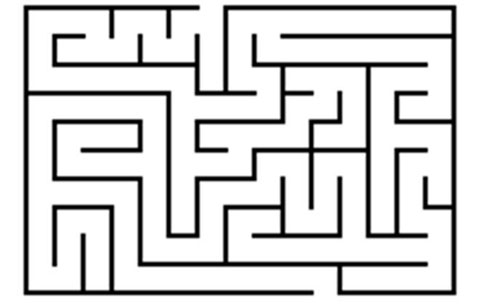

Ankit is in maze. The command center sent him a string which decodes to come out from the maze. He is initially at (0, 0). String contains L, R, U, D denoting left, right, up and down. In each command he will traverse 1 unit distance in the respective direction.

For example if he is at (2, 0) and the command is L he will go to (1, 0).