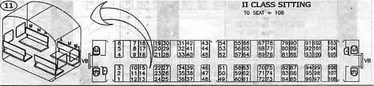

Akash and Vishal are quite fond of travelling. They mostly travel by railways. They were travelling in a train one day and they got interested in the seating arrangement of their compartment. The compartment looked something like

So they got interested to know the seat number facing them and the seat type facing them. The seats are denoted as follows :
- Window Seat : WS
- Middle Seat : MS
- Aisle Seat : AS

You will be given a seat number, find out the seat number facing you and the seat type, i.e. WS, MS or AS.